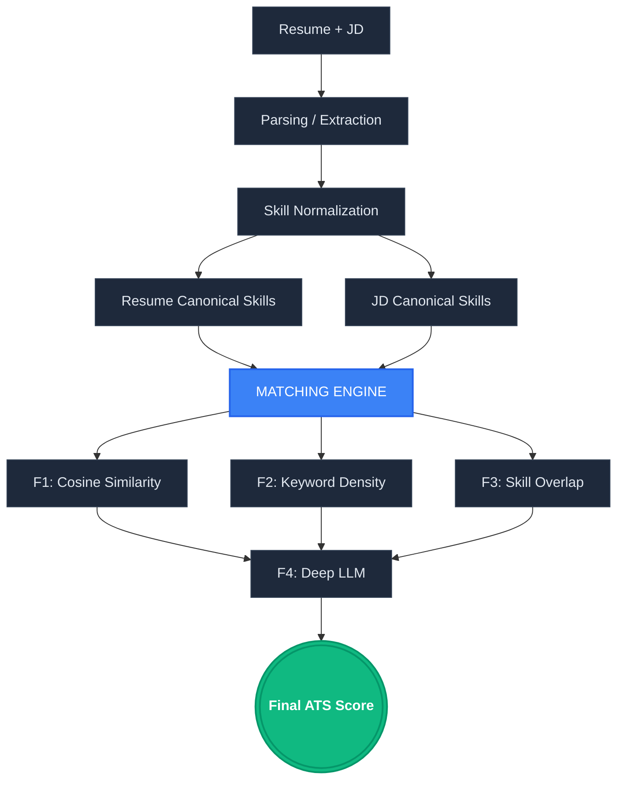

# ATS Scoring Architecture

Here is the architectural flow of the ATS Matcher as you described, visualized as a flowchart:



## ATS Score Calculation Breakdown

The Final ATS Score is computed by combining four distinct analytical factors (F1 to F4) using a weighted formula. The maximum possible score is 100%.

### 1. F1: Dense Vector Similarity (20% Weight)
- **What it measures:** Semantic overlap between your canonical skills and the job's canonical skills using embedding models.
- **Calculation:** `F1_Base_Score * 0.20`
- **Example from UI:** `6.9` out of `20`

### 2. F2: Keyword Density (20% Weight)
- **What it measures:** The percentage of exact vocabulary words (canonical skills) from the Job Description that are present in your Resume.
- **Base Formula:** `(Matched JD Words / Total JD Words) * 100 * 1.5 multiplier (capped at 100)`
- **Calculation:** `F2_Base_Score * 0.20`
- **Example from UI:** `4.3` out of `20`

### 3. F3: Skill Overlap (20% Weight)
- **What it measures:** Taxonomy-based mapping of explicit Technical and Soft skills.
- **Base Formula:** `Average(Technical Skills % Match, Soft Skills % Match)`
- **Calculation:** `F3_Base_Score * 0.20`
- **Example from UI:** `10.2` out of `20`

### 4. F4: Deep LLM Analysis (40% Weight)
- **What it measures:** Contextual alignment, impact, and relevancy evaluated by an AI recruiter model.
- **Calculation:** `F4_Base_Score * 0.40`
- **Example from UI:** `26` out of `40`

### Final Formula
```text
Total ATS Score = F1 + F2 + F3 + F4
```
*Example (from screenshot): `6.9 + 4.3 + 10.2 + 26 = 47%`*
